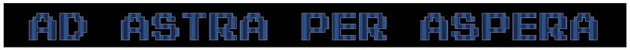
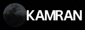
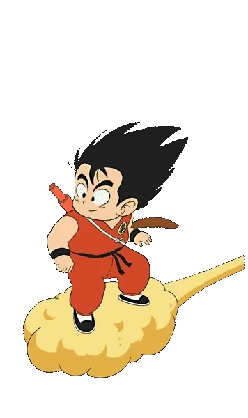

  

<h1><b>Hi,</b> I am   <b><i>!</i></b></h1>

I began my journey from <a href="https://www.learncpp.com"><i><b>LearnCpp</b></i></a>. After building a solid foundation in <b>Programming</b>, I started experimenting with <b>Flutter</b>, the <b>GTK library</b>, and eventually <b>React</b>. Eventually, I to decided to specialize in <b><i>MERN Stack Development</i></b> while continuing to focus on my university studies.

<table width="100%">
  <tr>
    <td width="50%" valign="top">
      <h2>This is <b><i>ME</i></b></h2>
      
---> <b>[🎓]</b> <i>Bachelor of Computer Science</i>

      
---> <b>[💻]</b> <i>MERN Stack Developer</i>

      
---> <b>[🛠️]</b> <i>Systems Engineering</i>

      
---> <b>[🧩]</b> <i>Problem Solving</i>

      
---> <b>[🌕]</b> <i>Moon</i>

      
cool <b><i>personal</i></b> site <b>⤵︎</b>

      

        
      

    </td>
    <td width="50%%" align="center" valign="top">
      
      
    </td>
  </tr>
</table>
